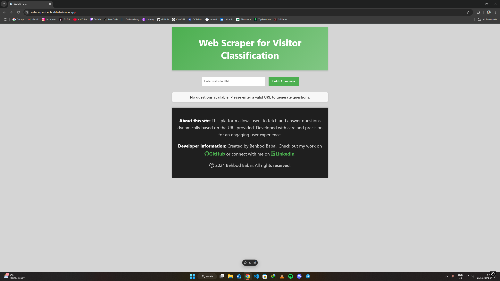

#

WebScraper

> Web Scraper for Visitor Classification.
>
> <!--Live demo [_here_]().  If you have the project hosted somewhere, include the link here. -->

## Table of Contents

- [General Info](#general-information)
- [Technologies Used](#technologies-used)
- [Screenshots](#screenshots)
- [Usage](#usage)
- [Project Status](#project-status)
- [Room for Improvement](#room-for-improvement)
- [Acknowledgements](#acknowledgements)
- [Contact](#contact)
<!-- * [License](#license) -->

## General Information

A Single Page Application that takes a website URL as input, scrapes its content, and classifies visitors based on their interests or industry. The goal is to dynamically generate questions and multiple-choice options that help categorize users visiting the site.

- The most Up-to-date and Deployed <b>Frontend</b> Repo can be viewed at: https://github.com/behi22/visitor-classifier-frontend

- The most Up-to-date and Deployed <b>Backend</b> Repo can be viewed at: https://github.com/behi22/visitor-classifier

<!-- You don't have to answer all the questions - just the ones relevant to your project. -->

## Technologies Used

- npm - 8.15.0
- React.js - 18.3.1
- Redux - 9.1.2
- antd - 5.22.2
- HTML - version html5
- CSS
- babel
- Axios
- AJAX
- git version 2.38.1.windows.1
- github
- Linux
- WSL
- Python
- Flask
- PostgreSQL
- Vercel
- Redis
- Render

## Screenshots

## Usage

The app should have the following features:

- **Frontend** - Neat and User-Friendly component based Frontend, created with React and deployed using Vercel
- **Backend API** - Python-based API, Properly implementing web scraping, data extraction, and AI-based content generation, deployed using Render
- **Storage** - Utilize PostgreSQL database for storage, Hosted on Render
- **Caching** - Utilize Redis for caching, Hosted on Redis Cloud
- Effective integration of Frontend and Backend components

## Project Status

Project is: Semi-Complete (Demo)

## Room for Improvement

- As indicated in the comments in [Home.js](/visitor-classifier-frontend/src/pages/Home.js), currently the answers for each question aren't submitted anywhere, and the logic could be developed further.

- The script for generating questions in [App.py](/visitor-classifier/app.py) is still very primitive and could be developed further with more time and resources at hand, so that we could generate more meaningful questions.

- There is an issue with the <ins>Missing Answers StyledParagraph</ins> inside [Home.js](/visitor-classifier-frontend/src/pages/Home.js) where it is still visible after submitting partial answers and changing the URL, that needs further time in debugging in order to resolve.

## Acknowledgements

- Many thanks to Brave Career for including me in their Software Engineer assessment project.

## Contact

Created by Behbod Babai - feel free to contact me via email!
my email: behibabai@gmail.com

<!-- Optional -->
<!-- ## License -->
<!-- This project is open source and available under the [... License](). -->

<!-- You don't have to include all sections - just the one's relevant to your project -->
